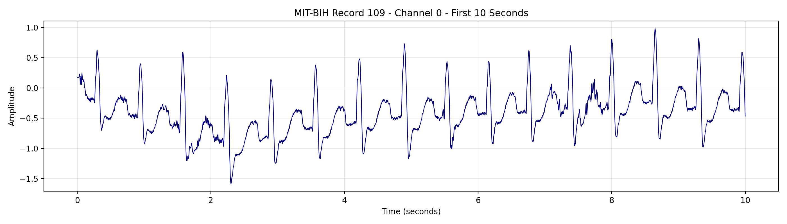
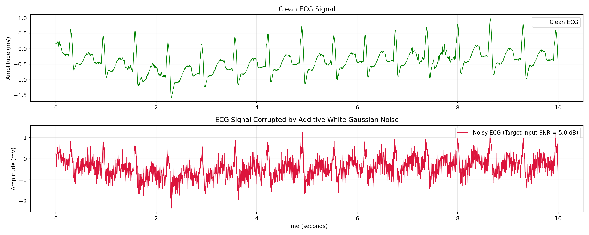
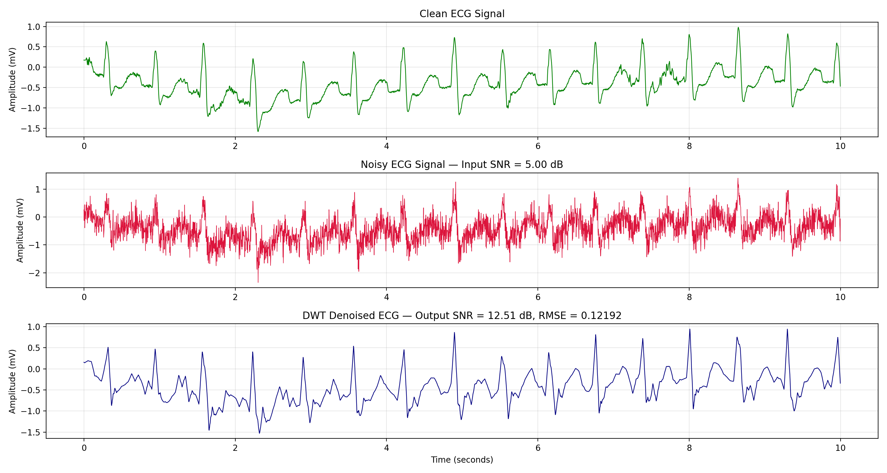
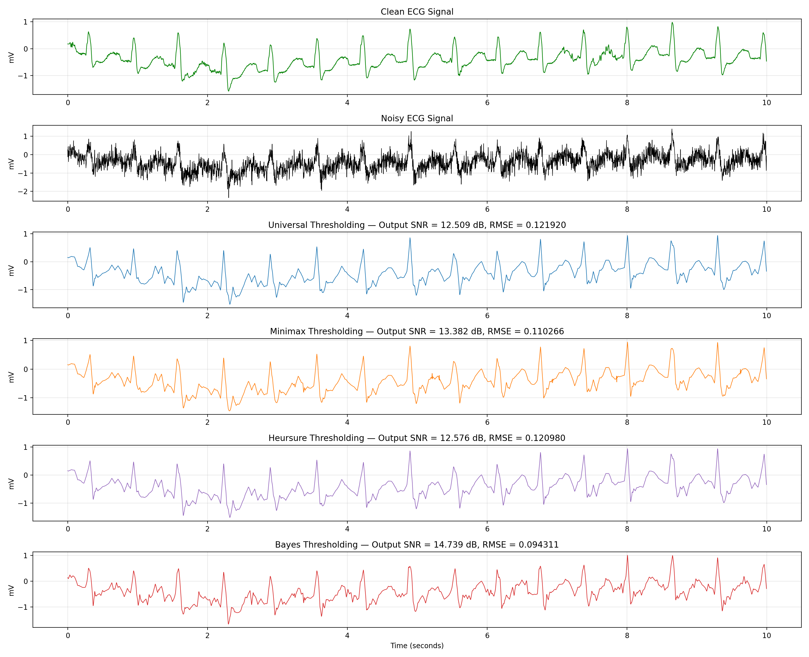
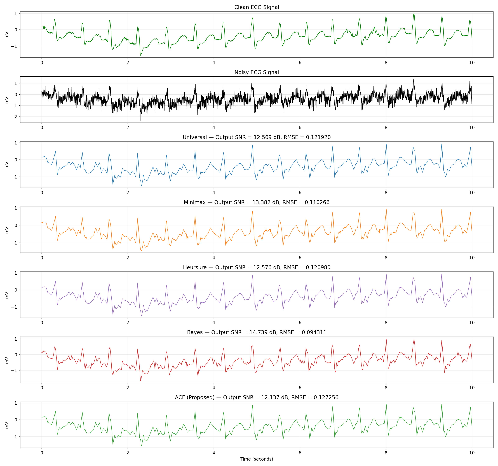
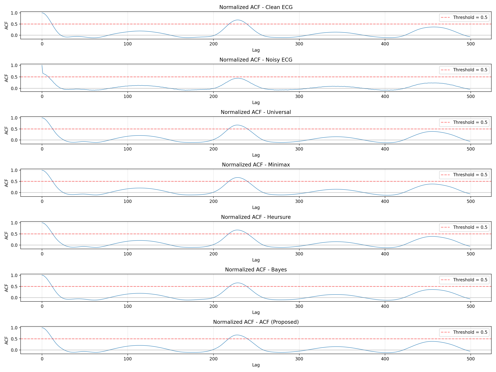

# Accurate ACF-based Wavelet Thresholding for ECG Denoising


A complete implementation of the paper **"Accurate wavelet thresholding method for ECG signals"** by Yu et al. (2024), published in *Computers in Biology and Medicine*.

This project implements an adaptive wavelet thresholding method based on the **Normalized Autocorrelation Function (ACF)** for real-time ECG denoising, outperforming traditional methods on real-world noise types such as muscle artifacts, baseline wander, and electrode motion noise.

---

## Table of Contents

- [Overview](#overview)
- [Methodology](#methodology)
- [Project Structure](#project-structure)
- [Datasets](#datasets)
- [Installation](#installation)
- [Usage](#usage)
- [Results](#results)
- [Key Findings](#key-findings)
- [Limitations](#limitations)
- [Future Work](#future-work)
- [References](#references)
- [License](#license)

---

## Overview

Cardiovascular disease is a leading cause of global mortality. ECG signals captured by wearable sensors are vulnerable to various types of noise, including:

- **Additive White Gaussian Noise (AWGN)**
- **Baseline Wander** (low-frequency noise from respiration)
- **Electrode Motion Artifacts** (sudden movements)
- **Muscle Artifacts** (EMG interference from muscle contractions)

Traditional wavelet thresholding methods (Universal, Minimax, Heursure, BayesShrink) estimate noise statistics first, then compute thresholds. However, these methods struggle when noise spectra overlap with the ECG signal spectrum.

**Key Innovation:** Instead of estimating noise, this method estimates the **periodic signal** using the Normalized Autocorrelation Function (ACF). The optimal threshold maximizes the **Normalized Zero-One Peak Percentage (NZOPP)** of the denoised signal's ACF.

---

## Methodology

### Pipeline

```
Noisy ECG → DWT Decomposition (db3, level 4) → Thresholding → Reconstruction → Denoised ECG
                                                      ↑
                                          Optimal Threshold via ACF/NZOPP
```

### 1. Wavelet Transform
- **Wavelet basis:** Daubechies-3 (db3)
- **Decomposition levels:** 4
- **Threshold function:** Soft thresholding (Eq. 4 in paper)

### 2. Classical Threshold Methods

| Method | Description |
|---|---|
| **Universal** | lambda = sigma * sqrt(2 * ln(N)) — Simple noise-based threshold |
| **Minimax** | Minimizes maximum possible error |
| **Heursure** | Hybrid of SURE and Universal thresholds |
| **BayesShrink** | Per-subband adaptive threshold |

### 3. Proposed ACF-based Method

1. **Normalized ACF Calculation** — Using FFT for O(N log N) efficiency
2. **NZOPP Criterion** — Ratio of ACF peaks above threshold to total peaks
3. **Fast Threshold Querying** — Iterative interpolation to find optimal threshold

### 4. Evaluation Metrics
- **SNR** (Signal-to-Noise Ratio) — Eq. (5) in paper
- **RMSE** (Root Mean Square Error) — Eq. (6) in paper

---

## Project Structure

```
Accurate_ACF_Wavelett/
├── datasets/
│   ├── mitdb/          # MIT-BIH Arrhythmia Database
│   ├── cudb/           # Creighton University VT Database
│   ├── ptb/            # PTB Diagnostic ECG Database
│   └── nstdb/          # MIT-BIH Noise Stress Test Database
├── src/
│   └── main.py         # Complete implementation (~2400 lines)
├── outputs/
│   ├── figures/        # Generated plots and comparisons
│   ├── results/        # Numerical results and tables
│   └── signals/        # Saved .npy signal files
├── requirements.txt
└── README.md
```

---

## Datasets

All datasets are from [PhysioNet](https://physionet.org/):

| Database | Records Used | Description |
|---|---|---|
| **MIT-BIH Arrhythmia** | 109, 233 | ECG with arrhythmias, 360 Hz |
| **CUDB** | cu07, cu11 | Ventricular tachyarrhythmia |
| **PTB Diagnostic** | s0016lre, s0026lre | Myocardial infarction |
| **NSTDB** | bw, em, ma | Real noise recordings |

---

## Installation

### Prerequisites
- Python 3.8 or higher
- Google Colab account (recommended) or local Python environment

### Setup for Local Environment

```bash
# Clone the repository
git clone https://github.com/ali-mohamadpour/Accurate-ACF-based-Wavelet-Thresholding-for-ECG-Denoising.git
cd Accurate_ACF_Wavelett

# Install dependencies
pip install numpy matplotlib wfdb PyWavelets

# Download datasets manually from PhysioNet
# Place them in the appropriate folders under datasets/
```

---

## Usage

### Run Complete Pipeline

In Google Colab, after running the setup cells:

```python
# Run the main script
!python src/main.py
```

In local environment:

```bash
python src/main.py
```

This executes all 6 phases:

1. **Phase 1:** Dataset validation and loading
2. **Phase 2:** AWGN generation and metric validation
3. **Phase 3:** Basic wavelet denoising pipeline test
4. **Phase 4:** Classical methods comparison
5. **Phase 5:** ACF-based adaptive thresholding
6. **Phase 6:** Real noise experiments

### Output Files

```
outputs/
├── figures/
│   ├── phase1_mitdb_109_first_10_seconds.png
│   ├── phase2_clean_vs_awgn_5db_record109.png
│   ├── phase3_dwt_universal_soft_record109_awgn5db.png
│   ├── phase4_classical_methods_record109_awgn5db.png
│   ├── phase5_acf_comparison_record109_awgn5db.png
│   └── phase5_acf_debug_record109_awgn5db.png
├── results/
│   ├── phase5_comparison_table.txt
│   └── phase6_real_noise_summary.txt
└── signals/
    ├── record109_clean_30s.npy
    ├── record109_awgn_5db_30s.npy
    ├── record109_universal_soft_5db_30s.npy
    ├── record109_minimax_soft_5db_30s.npy
    ├── record109_heursure_soft_5db_30s.npy
    ├── record109_bayes_soft_5db_30s.npy
    └── record109_acf_soft_5db_30s.npy
```

---

## Results

### AWGN Test (Input SNR = 5 dB, Record 109)

| Method | Threshold | Output SNR (dB) | RMSE |
|---|---|---|---|
| Universal | 1.2277 | 12.5090 | 0.1219 |
| Minimax | 0.8102 | 13.3816 | 0.1103 |
| Heursure | 1.1811 | 12.5762 | 0.1210 |
| **Bayes** | [per-subband] | **14.7392** | **0.0943** |
| ACF (Proposed) | 1.7448 | 12.1369 | 0.1273 |

### Real Noise Tests (Input SNR = 0 dB, Record 109)

| Method | Baseline Wander | Electrode Motion | **Muscle Artifact** |
|---|---|---|---|
| Universal | -0.0004 | 0.0185 | 0.2462 |
| Minimax | 0.0011 | 0.0143 | 0.1760 |
| Heursure | -0.0002 | 0.0085 | 0.0720 |
| Bayes | 0.0006 | 0.0013 | 0.0106 |
| **ACF (Proposed)** | -0.1679 | -0.0944 | **0.7672** |

> **Key Finding:** For Muscle Artifact noise, the ACF method achieves **0.7672 dB SNR improvement** — approximately **3x better** than the second-best method (Universal at 0.2462 dB).

---

## Key Findings

1. **AWGN Performance:** BayesShrink performs best (14.74 dB) due to per-subband adaptive thresholds. The ACF method is slightly weaker, consistent with the paper's claims.

2. **Muscle Artifact Performance:** The ACF method significantly outperforms all classical methods (0.7672 vs 0.2462 dB improvement), confirming the paper's main contribution.

3. **Baseline Wander & Electrode Motion:** Classical methods perform better. The ACF method struggles because these noise types have spectral characteristics similar to ECG.

4. **Computational Cost:** The ACF method requires ~35 iterations for convergence, making it slower than classical methods but still suitable for real-time applications.

---

## Limitations

1. **Periodic Signal Requirement:** The ACF-based method is only suitable for periodic signals like ECG.
2. **Baseline Wander Sensitivity:** Low-frequency noise corrupts the ACF structure.
3. **Threshold Sensitivity:** The NZOPP peak detection threshold (0.1 vs 0.5 in paper) requires tuning.
4. **Computational Overhead:** Iterative threshold search is slower than single-pass methods.

---
## Sample Output








---
## Future Work

1. **Preprocessing Integration:** Add high-pass filtering to remove baseline wander before ACF calculation.
2. **Advanced Wavelets:** Extend to Stationary Wavelet Transform (SWT) or Dual-Tree Complex Wavelet Transform (DTCWT).
3. **Joint Optimization:** Simultaneously optimize decomposition level and threshold.
4. **Other Biosignals:** Apply to PPG, EEG, or other periodic biomedical signals.
5. **Deep Learning Hybrid:** Combine ACF-based thresholding with neural networks for automatic parameter tuning.

---

## References

1. Yu, K., et al. (2024). "Accurate wavelet thresholding method for ECG signals." *Computers in Biology and Medicine*, 169, 107835.

---

## License

This project is licensed under the MIT License - see the LICENSE file for details.

---

## Author

**my name** - [Ali Mohammadpour](http://ali-mohammadpour.ir)


Project Link: [https://github.com/ali-mohamadpour/Accurate-ACF-based-Wavelet-Thresholding-for-ECG-Denoising](https://github.com/ali-mohamadpour/Accurate-ACF-based-Wavelet-Thresholding-for-ECG-Denoising)

---

## Acknowledgments

- The authors of the original paper for their innovative work
- PhysioNet for providing open-access ECG databases
- The open-source community for libraries (NumPy, PyWavelets, WFDB, Matplotlib)

---
## Google Colab

Click the button below to open and run the notebook in Google Colab.

[](https://colab.research.google.com/drive/1xeoEbpjjXB6oHIl7LN3d46EcSWTI4iBU?usp=sharing
)
